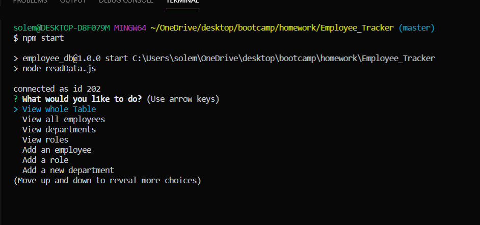

# Employee_Tracker

  

  ## Description 

  I built this app to organize a company and it's employers into a table using salary, departnemt, roles and name. 

  


  ## Table of Contents 
  
  * [instalation](#instalation)
  * [Usage](#usage)
  * [License](#license)
  * [Contributing](#contributing)
  * [Questions](#questions)
  
  ## Installation 
  
  To install necessary dependancies, run the following command: 
  ```
  npm i
  ```
  ## Usage
  
  Please use this program to organize your employees and managment. In order to start the program please open the terminal and type 'npm start'.
  
  ## License
  
  This project is licensed under the MIT license 
  
  ## Contributing
  
  Please pull from the master branch and make pull requests before you attempt to contribute to this repo.
  

 ## Questions
  
 If you have any questions about the repo, open an issue or contact me directly at [solemansay](https://github.com/solemansay/). 
 Or send me an email at solemansay@gmail.com

 ```
Thank you for viewing my employee tracker project! I hoped you enjoyed my solution 
and continue to follow my career as a jr full-stack web developer. 
-Soleman Sayeed
```
